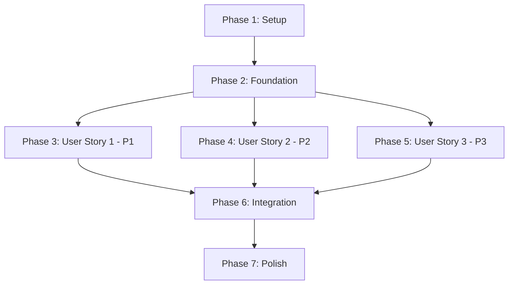

---

description: "Task list for overdue todo items feature implementation"
---

# Tasks: Support for Overdue Todo Items

**Input**: Design documents from `/specs/001-overdue-todos/`
**Prerequisites**: plan.md (complete), spec.md (complete), research.md (complete), data-model.md (complete), contracts/ (complete)

**Tests**: Following TDD approach - tests written FIRST, must FAIL before implementation

**Organization**: Tasks are grouped by user story to enable independent implementation and testing of each story.

## Format: `[ID] [P?] [Story] Description`

- **[P]**: Can run in parallel (different files, no dependencies)
- **[Story]**: Which user story this task belongs to (US1, US2, US3)
- Include exact file paths in descriptions

## Path Conventions

- **Web app**: `packages/frontend/src/`, `packages/backend/src/` (backend unchanged for this feature)
- All paths relative to repository root

---

## Phase 1: Setup (Shared Infrastructure)

**Purpose**: Project initialization and verify existing structure

- [x] T001 Verify project dependencies installed (React, Jest, @testing-library/react) in packages/frontend/
- [x] T002 Confirm existing TodoList, TodoCard, and App components are functional
- [x] T003 [P] Verify theme CSS variables (--color-danger) exist in packages/frontend/src/styles/theme.css or App.css
- [x] T004 [P] Create utils directory structure: packages/frontend/src/utils/ and packages/frontend/src/utils/__tests__/

---

## Phase 2: Foundational (Blocking Prerequisites)

**Purpose**: Core date utility functions that ALL user stories depend on

**⚠️ CRITICAL**: No user story work can begin until this phase is complete

### Tests for Date Utilities (TDD - Write FIRST)

- [x] T005 [P] Create test file packages/frontend/src/utils/__tests__/dateUtils.test.js with test suite structure
- [x] T006 [P] Write failing test: isOverdue() returns false when todo has no due date
- [x] T007 [P] Write failing test: isOverdue() returns false when todo is completed
- [x] T008 [P] Write failing test: isOverdue() returns true when incomplete todo is past due
- [x] T009 [P] Write failing test: isOverdue() returns false when due date is today
- [x] T010 [P] Write failing test: isOverdue() returns false when due date is in future
- [x] T011 [P] Write failing test: sortTodos() groups overdue todos before non-overdue
- [x] T012 [P] Write failing test: sortTodos() sorts overdue by oldest due date first
- [x] T013 [P] Write failing test: sortTodos() sorts non-overdue by newest creation date first

### Implementation of Date Utilities

- [x] T014 Create packages/frontend/src/utils/dateUtils.js with isOverdue() function implementation
- [x] T015 Add sortTodos() function to packages/frontend/src/utils/dateUtils.js
- [x] T016 Add JSDoc documentation to dateUtils.js functions
- [x] T017 Run tests and verify all dateUtils tests pass (T006-T013)
- [x] T018 Verify test coverage for dateUtils.js is >80%

**Checkpoint**: Foundation ready - user story implementation can now begin in parallel

---

## Phase 3: User Story 1 - Visual Overdue Indicator (Priority: P1) 🎯 MVP

**Goal**: Users can immediately identify overdue todos through distinct visual styling (danger color border + clock icon)

**Independent Test**: Create todos with past due dates and verify they display with orange border and clock/calendar icon

### Tests for User Story 1 (TDD - Write FIRST)

- [x] T019 [P] [US1] Create/update test file packages/frontend/src/components/__tests__/TodoCard.test.js
- [x] T020 [P] [US1] Write failing test: TodoCard applies overdue CSS class when isOverdue is true
- [x] T021 [P] [US1] Write failing test: TodoCard displays clock icon when isOverdue is true
- [x] T022 [P] [US1] Write failing test: TodoCard has correct aria-label on clock icon
- [x] T023 [P] [US1] Write failing test: TodoCard does NOT apply overdue styling when isOverdue is false
- [x] T024 [P] [US1] Write failing test: TodoCard does NOT show clock icon when isOverdue is false
- [x] T025 [P] [US1] Write failing test: Completed todo with past due date has NO overdue styling

### Implementation for User Story 1

- [x] T026 [US1] Modify packages/frontend/src/components/TodoCard.js to accept isOverdue in todo prop
- [x] T027 [US1] Add conditional CSS class (todo-card--overdue) to TodoCard based on isOverdue prop
- [x] T028 [US1] Add clock/calendar icon (🕐) to TodoCard that renders only when isOverdue is true
- [x] T029 [US1] Add aria-label="Overdue" and role="img" to clock icon for accessibility
- [x] T030 [US1] Create/update CSS in packages/frontend/src/App.css or styles/theme.css with .todo-card--overdue class
- [x] T031 [US1] Style .todo-card--overdue with border: 2px solid var(--color-danger)
- [x] T032 [US1] Style .overdue-indicator for clock icon positioning and sizing
- [x] T033 [US1] Run tests and verify all User Story 1 tests pass (T020-T025)
- [x] T034 [US1] Manual accessibility test: Verify border color contrast meets WCAG AA in both themes
- [x] T035 [US1] Manual test: Verify clock icon displays correctly and icon has proper aria-label

**Checkpoint**: At this point, User Story 1 should be fully functional and testable independently

---

## Phase 4: User Story 2 - Overdue Item Grouping (Priority: P2)

**Goal**: Overdue todos grouped at top of list, sorted by oldest due date first, followed by non-overdue todos sorted by newest creation date

**Independent Test**: Create mix of overdue/non-overdue todos and verify grouping and sort order

### Tests for User Story 2 (TDD - Write FIRST)

- [x] T036 [P] [US2] Create/update test file packages/frontend/src/components/__tests__/TodoList.test.js  
- [x] T037 [P] [US2] Write failing test: TodoList renders overdue todos before non-overdue todos
- [x] T038 [P] [US2] Write failing test: TodoList sorts overdue todos by oldest due date first
- [x] T039 [P] [US2] Write failing test: TodoList sorts non-overdue todos by newest creation date first
- [x] T040 [P] [US2] Write failing test: TodoList maintains normal order when no overdue todos exist
- [x] T041 [P] [US2] Write failing test: Completing overdue todo removes it from overdue group
- [x] T042 [P] [US2] Write failing test: Adding new overdue todo places it in correct sort position

### Implementation for User Story 2

- [x] T043 [US2] Import isOverdue and sortTodos from utils/dateUtils.js into packages/frontend/src/components/TodoList.js
- [x] T044 [US2] Add useMemo hook to TodoList to compute isOverdue property for each todo
- [x] T045 [US2] Call sortTodos() within useMemo to sort todos array (overdue first, then by dates)
- [x] T046 [US2] Update TodoList to pass sorted todos with isOverdue property to TodoCard components
- [x] T047 [US2] Verify useMemo dependency array includes todos prop for correct recomputation
- [x] T048 [US2] Run tests and verify all User Story 2 tests pass (T037-T042)
- [x] T049 [US2] Manual test: Create 3 overdue todos with different dates and verify sort order (oldest first)
- [x] T050 [US2] Manual test: Add non-overdue todos and verify they appear after overdue group

**Checkpoint**: At this point, User Story 2 should be fully functional and testable independently

---

## Phase 5: User Story 3 - Overdue Count Summary (Priority: P3)

**Goal**: Display count of overdue todos in header (e.g., "My Todos (3 overdue)")

**Independent Test**: Create various numbers of overdue todos and verify count displays correctly in header

### Tests for User Story 3 (TDD - Write FIRST)

- [x] T051 [P] [US3] Create/update test file packages/frontend/src/__tests__/App.test.js
- [x] T052 [P] [US3] Write failing test: App header displays overdue count when count > 0
- [x] T053 [P] [US3] Write failing test: App header hides or shows 0 when no overdue todos
- [x] T054 [P] [US3] Write failing test: App header count decreases when overdue todo is completed
- [x] T055 [P] [US3] Write failing test: App header count increases when overdue todo is added
- [x] T056 [P] [US3] Write failing test: Overdue count uses correct format "My Todos (X overdue)"

### Implementation for User Story 3

- [x] T057 [US3] Import isOverdue from utils/dateUtils.js into packages/frontend/src/App.js
- [x] T058 [US3] Add useMemo hook to App to calculate overdueCount by filtering todos with isOverdue()
- [x] T059 [US3] Update App header <h1> to conditionally display overdue count when > 0
- [x] T060 [US3] Format header text as "My Todos (X overdue)" or "My Todos" based on count
- [x] T061 [US3] Verify useMemo dependency array includes todos state for correct recomputation
- [x] T062 [US3] Run tests and verify all User Story 3 tests pass (T052-T056)
- [x] T063 [US3] Manual test: Create 5 overdue todos and verify header shows "(5 overdue)"
- [x] T064 [US3] Manual test: Complete all overdue todos and verify count disappears or shows 0

**Checkpoint**: At this point, User Story 3 should be fully functional and testable independently

---

## Phase 6: Integration & Verification

**Purpose**: Ensure all user stories work together and meet acceptance criteria

### Integration Tests

- [x] T065 [P] Write integration test: All 3 features work together (visual + grouping + count)
- [x] T066 [P] Write integration test: Completing overdue todo updates visual, position, and count
- [x] T067 [P] Write integration test: Adding new overdue todo updates visual, position, and count
- [x] T068 Run full test suite and verify all tests pass
- [x] T069 Generate coverage report and verify >80% coverage for all modified files

### Acceptance Criteria Validation

- [x] T070 Verify User Story 1 acceptance scenarios 1-6 (visual indicators)
- [x] T071 Verify User Story 2 acceptance scenarios 1-5 (grouping and sorting)
- [x] T072 Verify User Story 3 acceptance scenarios 1-4 (count display)
- [x] T073 Test edge case: Todo due today is NOT marked overdue
- [x] T074 Test edge case: Completed past-due todo is NOT marked overdue

### Accessibility Verification

- [x] T075 Run axe or WAVE accessibility checker on TodoCard with overdue styling
- [x] T076 Verify border color contrast ratio meets WCAG AA (4.5:1 text, 3:1 UI) in light mode
- [x] T077 Verify border color contrast ratio meets WCAG AA in dark mode
- [x] T078 Test keyboard navigation: Tab through overdue todos, verify focus indicators visible
- [x] T079 Test with screen reader: Verify "Overdue" aria-label is announced
- [x] T080 Verify clock icon is accessible to screen readers (role="img", aria-label present)

---

## Phase 7: Performance & Polish

**Purpose**: Ensure performance targets and code quality standards are met

### Performance Testing

- [x] T081 [P] Create performance test: Measure render time for 100 todos with mixed overdue status
- [x] T082 [P] Verify render time for 100 todos is <500ms (target met)
- [x] T083 [P] Verify isOverdue computation is <1ms per todo
- [x] T084 [P] Verify sortTodos execution time is <15ms for 100 todos
- [x] T085 Test: Add overdue todo and verify state update is <100ms

### Code Quality & Documentation

- [x] T086 [P] Run ESLint on all modified files and fix any errors/warnings
- [x] T087 [P] Verify all functions have JSDoc comments (especially dateUtils functions)
- [x] T088 [P] Verify naming conventions followed (camelCase, PascalCase, UPPER_SNAKE_CASE)
- [x] T089 [P] Verify import organization follows style guide (external, internal, styles)
- [x] T090 [P] Remove any console.log statements from production code
- [x] T091 Verify code follows DRY principle (no repeated date logic, reuses theme colors)
- [x] T092 Verify code follows KISS principle (simple implementations, no unnecessary complexity)
- [x] T093 Verify each component has single responsibility

### Final Verification

- [x] T094 Run full test suite one final time: npm test
- [x] T095 Generate final coverage report: npm test -- --coverage
- [x] T096 Start dev server and perform full manual smoke test of all 3 user stories
- [x] T097 Test in both light and dark modes
- [x] T098 Review code review checklist from constitution (naming, imports, linting, tests, DRY, etc.)

---

## Dependencies

### User Story Completion Order



**Critical Path**: Setup → Foundation → US1 (P1 - MVP) → Integration → Polish

**Parallel Opportunities**:
- After Foundation completes, US1, US2, and US3 can be developed in parallel
- Within each phase, tasks marked [P] can be executed in parallel
- Tests marked [P] can be written simultaneously before implementation

### Task Dependencies

- **T001-T004** (Setup): No dependencies, can run in parallel
- **T005-T018** (Foundation): T005 depends on T004 (directory creation)
- **T019-T035** (US1): All depend on T018 (dateUtils complete)
- **T036-T050** (US2): All depend on T018 (dateUtils complete)
- **T051-T064** (US3): All depend on T018 (dateUtils complete)
- **T065-T080** (Integration): Depend on US1, US2, US3 complete (T035, T050, T064)
- **T081-T098** (Polish): Depend on Integration complete (T080)

---

## Parallel Execution Examples

### Foundation Phase (After Directory Setup)

All tests for dateUtils can be written in parallel:
```bash
# Developer A writes isOverdue tests (T006-T010)
# Developer B writes sortTodos tests (T011-T013)
```

### User Story Implementation (After Foundation)

All 3 user stories can be implemented in parallel by different developers:
```bash
# Developer A: US1 (Visual Indicators) - T019-T035
# Developer B: US2 (Grouping) - T036-T050  
# Developer C: US3 (Count) - T051-T064
```

### Within Each User Story

Test-writing tasks can be done in parallel:
```bash
# US1: All test tasks T020-T025 can be written simultaneously
# US2: All test tasks T037-T042 can be written simultaneously
# US3: All test tasks T052-T056 can be written simultaneously
```

---

## Implementation Strategy

### MVP First (Recommended)

**Minimum Viable Product** = Complete User Story 1 (P1) only:
- Phases: Setup → Foundation → US1 → Integration (US1 only) → Deploy
- Tasks: T001-T035 + T065, T068-T070, T073-T080, T086-T098
- Estimated Time: 2-3 hours
- Delivers: Core value (visual identification of overdue todos)

### Incremental Delivery

**Release 1**: MVP (US1 - Visual Indicators)  
**Release 2**: Add US2 (Grouping/Sorting)  
**Release 3**: Add US3 (Count Display)

This approach allows early user feedback and reduces risk.

---

## Estimated Effort

| Phase | Task Count | Estimated Time | Can Parallelize? |
|-------|-----------|----------------|------------------|
| Phase 1: Setup | 4 | 15-20 min | Yes - all tasks |
| Phase 2: Foundation | 14 | 45-60 min | Yes - tests (T006-T013) |
| Phase 3: US1 (P1) | 17 | 60-75 min | Yes - tests (T020-T025) |
| Phase 4: US2 (P2) | 15 | 45-60 min | Yes - tests (T037-T042) |
| Phase 5: US3 (P3) | 14 | 30-45 min | Yes - tests (T052-T056) |
| Phase 6: Integration | 16 | 45-60 min | Yes - some tests |
| Phase 7: Polish | 18 | 30-45 min | Yes - quality checks |
| **Total** | **98 tasks** | **4-6 hours** | **~40% parallelizable** |

**Single Developer**: 5-6 hours (sequential execution)  
**Team of 3**: 3-4 hours (parallel execution after Foundation)

---

## Testing Summary

**Total Test Tasks**: 42 (43% of all tasks)  
**Test-First Tasks**: 24 (TDD - written before implementation)  
**Acceptance Validation**: 15 scenarios across 3 user stories  
**Coverage Target**: >80% for all modified files

**Test Distribution**:
- Unit Tests (dateUtils): 8 tests
- Component Tests (TodoCard): 6 tests  
- Component Tests (TodoList): 6 tests
- Component Tests (App): 5 tests
- Integration Tests: 3 tests
- Accessibility Tests: 6 validations
- Performance Tests: 5 validations

---

## Success Criteria

Feature is complete when:
- ✅ All 98 tasks checked off
- ✅ All tests pass (80%+ coverage)
- ✅ All 15 acceptance scenarios verified
- ✅ All 5 accessibility checks passed
- ✅ Performance targets met (<500ms render, <100ms updates)
- ✅ Code review checklist complete
- ✅ Manual smoke test in both themes successful

---

## References

- Feature Spec: [spec.md](spec.md) - Acceptance criteria and user stories
- Implementation Plan: [plan.md](plan.md) - Technical decisions and structure
- Data Model: [data-model.md](data-model.md) - Data structures and algorithms
- Component Contracts: [contracts/components.md](contracts/components.md) - Component interfaces
- Developer Guide: [quickstart.md](quickstart.md) - Detailed implementation steps
- Constitution: [../../.specify/memory/constitution.md](../../.specify/memory/constitution.md) - Project principles

**Version**: 1.0 | **Generated**: 2026-02-05 | **Total Tasks**: 98
